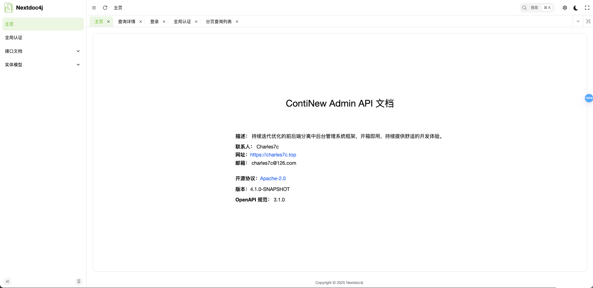
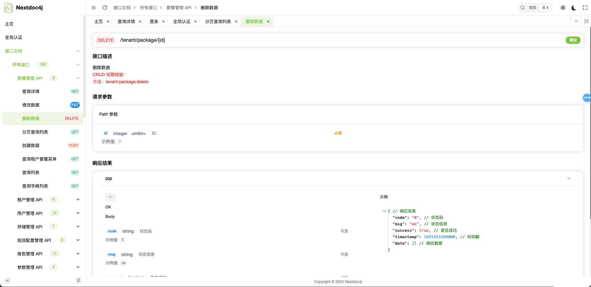
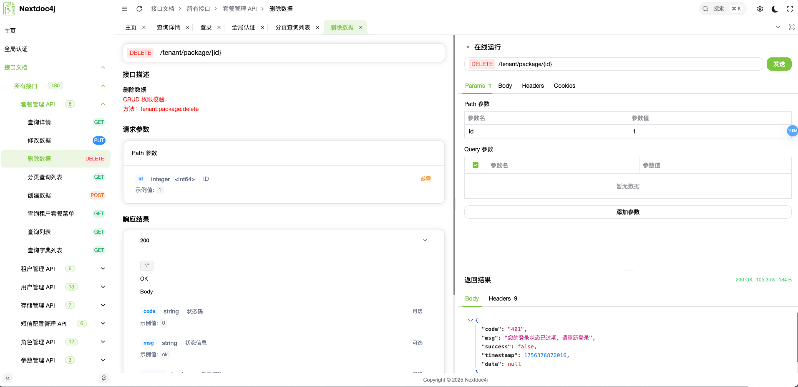

# Nextdoc4j UI

<div align="center">

**现代化的 API 文档界面解决方案**

基于 Vue 3 + TypeScript + Vite 构建，深度整合 SpringDoc，完美替代 Swagger UI

[在线演示](https://demo.dockit4j.top/) | [文档](https://docs.dockit4j.top) | [后端项目](https://gitee.com/nextdoc4j/nextdoc4j)

</div>

## 📖 项目简介

Nextdoc4j UI 是一个现代化的 API 文档前端界面，专为 Nextdoc4j 后端项目打造。它基于优秀的 [Vue Vben Admin](https://github.com/vbenjs/vue-vben-admin) 框架进行二次开发，提供了比传统 Swagger UI 更加美观、易用的 API 文档浏览体验。

### ✨ 核心特性

- 🎨 **现代化设计** - 基于最新设计规范，提供优雅的用户体验
- ⚡ **性能优异** - 基于 Vue 3 + Vite，构建快速，运行流畅
- 🔧 **深度整合** - 与 SpringDoc 深度集成，完美替代 Swagger UI
- 🎯 **TypeScript** - 全面的类型安全保障

## 🖼️ 界面预览

### 主界面



### API 文档浏览



### 接口测试



## 🚀 快速开始

### 环境要求

- **Node.js**: >= 18.0.0
- **pnpm**: >= 9.12.0 (推荐)

### 安装依赖

```bash
# 克隆项目
# 进入项目目录
cd nextdoc4j-ui

# 安装依赖
pnpm install
```

### 开发

```bash
# 启动开发服务器
pnpm dev

# 访问 http://localhost:5777
```

### 构建

```bash
# 构建生产版本
pnpm build
```

## 📁 项目结构

```
nextdoc4j-ui/
├── apps/
│   └── web-ele/              # 主应用
├── packages/
│   ├── @core/                # 核心功能包
│   ├── constants/            # 常量定义
│   ├── effects/              # 副作用处理
│   ├── icons/                # 图标组件库
│   ├── locales/              # 国际化资源
│   ├── preferences/          # 用户偏好设置
│   ├── stores/               # 状态管理 (Pinia)
│   ├── styles/               # 全局样式
│   ├── types/                # TypeScript 类型定义
│   └── utils/                # 通用工具函数
├── internal/
│   ├── lint-configs/         # ESLint/Prettier 配置
│   ├── node-utils/           # Node.js 工具函数
│   ├── tailwind-config/      # TailwindCSS 配置
│   ├── tsconfig/             # TypeScript 配置
│   └── vite-config/          # Vite 构建配置
├── scripts/
│   ├── clean.mjs             # 清理脚本
│   ├── turbo-run/            # Turbo 运行脚本
│   └── vsh/                  # Shell 脚本工具
├── licenses/
│   ├── LICENSE-Apache-2.0    # Apache 2.0 许可证
│   └── LICENSE-MIT-Vben      # Vben MIT 许可证
├── cspell.json               # 拼写检查配置
├── eslint.config.mjs         # ESLint 配置
├── lefthook.yml              # Git hooks 配置
├── pnpm-workspace.yaml       # pnpm 工作区配置
├── stylelint.config.mjs      # 样式检查配置
├── tea.yaml                  # Tea 包管理器配置
├── turbo.json                # Turbo 构建配置
├── vitest.config.ts          # Vitest 测试配置
├── vitest.workspace.ts       # Vitest 工作区配置
└── vben-admin.code-workspace # VS Code 工作区配置
```

## 🔧 技术栈

- **框架**: Vue 3 + TypeScript
- **构建工具**: Vite
- **包管理**: pnpm + Monorepo (Turbo)
- **UI 组件**: 基于 Vben Admin
- **状态管理**: Pinia
- **路由**: Vue Router 4
- **样式**: TailwindCSS
- **代码规范**: ESLint + Prettier + Stylelint
- **测试**: Vitest

## 🤝 与后端集成

本项目专为 Nextdoc4j 后端设计，提供无缝集成体验：

1. **自动 API 发现**: 自动读取 SpringDoc 生成的 OpenAPI 规范
2. **实时文档同步**: 后端 API 变更时前端文档自动更新
3. **在线接口测试**: 内置接口测试工具，支持各种认证方式
4. **类型安全**: 基于 OpenAPI 规范自动生成 TypeScript 类型

## 📄 许可证

本项目基于以下许可证发布：

- 主项目: [Apache-2.0 License](LICENSE)
- Vben Admin 部分: [MIT License](licenses/LICENSE-MIT-Vben)

## 🙏 致谢

- [Vue Vben Admin](https://github.com/vbenjs/vue-vben-admin) - 优秀的 Vue 3 管理后台框架
- [Vue.js](https://vuejs.org/) - 渐进式 JavaScript 框架
- [Vite](https://vitejs.dev/) - 下一代前端构建工具

---

<div align="center">

如果这个项目对你有帮助，请给它一个 ⭐️

</div>
